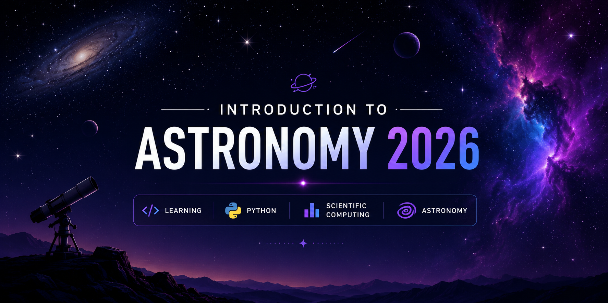

<h1 align="center">🌌 Intro to Astronomy 2026</h1>

<p align="center">
  
</p>

<p align="center">
  <b>Exploring the Universe through Astronomy, Data Science & Python.</b>
  <br><br>
  
  
  
  
</p>

---

## ✨ About

This repository documents my journey through the **Introduction to Astronomy 2026** program.

It serves as a personal portfolio of everything I learned throughout the program, including lecture notes, coding exercises, scientific notebooks, assignments, and exploratory projects in astronomy and data analysis.

Rather than simply storing coursework, this repository reflects my progress in combining **astronomy**, **scientific programming**, and **computational thinking**.

---
## 🛠 Tech Stack

| Language | Libraries | Environment |
|-----------|-----------|-------------|
| Python | NumPy | Jupyter Notebook |
| Python | Pandas | VS Code |
| Python | Matplotlib | Git & GitHub |

---

## 📂 Repository Structure

```text
intro-to-astronomy-2026/
│
├── assets/
│   └── banner.png
│
├── notebooks/
│   ├── week01/
│   │   ├── README.md   
│   │   └── assignments/
│   │       ├── assignment_01_terminal_practice/
│   │       │   ├── foo_dir/
│   │       │   │   ├── foo_sub_dir/
│   │       │   │   │   └── hello_copy.txt
│   │       │   │   ├── hello.txt
│   │       │   │   └── hello_copy.txt
│   │       │   ├── images/
│   │       │   └── links.txt
│   │       ├── assignment_02_unix_shell/
│   │       │   └── links.txt
│   │       ├── assignment_03_github/
│   │       │   └── links.txt
│   │       └── assignment_04_git/
│   │           ├── images/
│   │           └── links.txt
│   ├── week02/
│   ├── week03/
│   ├── week04/
│   ├── week05/
│   └── week06/
│
├── datasets/
│
├── README.md
└── LICENSE
```

---

## 📖 Learning Objectives

✔ Understand the fundamentals of astronomy

✔ Learn scientific programming with Python

✔ Analyze astronomical datasets

✔ Create reproducible computational notebooks

✔ Develop data visualization skills

✔ Explore real-world astronomy applications

---

## 📅 Progress Tracker

| Module | Status |
|---------|--------|
| Week 1 | ✔ |
| Week 2 | ⏳ |
| Week 3 | ⏳ |
| Week 4 | ⏳ |
| Week 5 | ⏳ |
| Week 6 | ⏳ |

---

> "The Universe is under no obligation to make sense to you."
>
> — Neil deGrasse Tyson

---

## 📈 Repository Goals

- Maintain clean and well-documented notebooks.
- Record my learning process throughout the program.
- Build a portfolio of scientific programming projects.
- Continuously improve my Python and data analysis skills.

---

## 🤝 Acknowledgements

This repository is based on the learning materials provided during the **Introduction to Astronomy 2026** program.

All implementations, notes, and experiments represent my personal learning journey.

---

<p align="center">

### 🌌 *Keep Looking Up.*

*"Somewhere, something incredible is waiting to be known."*  
— Carl Sagan

⭐ If you find this repository interesting, feel free to explore it!

</p>
